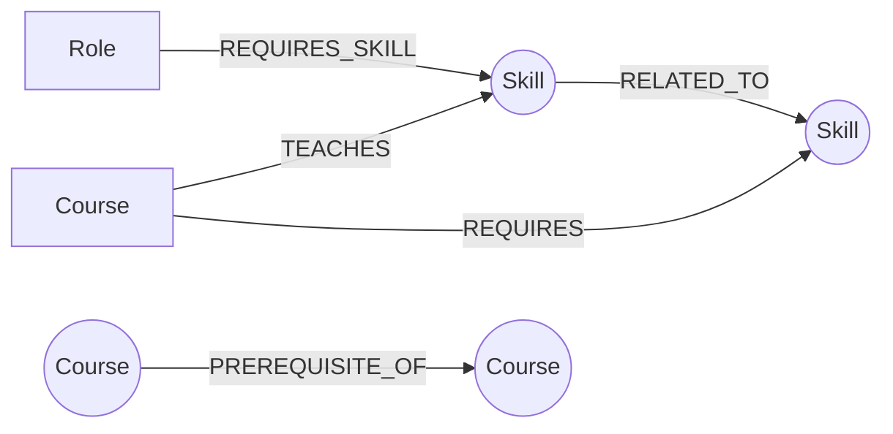

# Skill Atlas

**Skill Atlas** turns a job-search question — *"what do I actually need to learn to become an X?"* — into a graph traversal. Skills, courses and job roles are modeled as a connected graph in [CognoDB](https://console.cognodb.com), and the app walks that graph to answer questions a flat spreadsheet can't: which roles are you already closest to, which courses close the gap, and in what order should you take them given each course's own prerequisites.

- **Live demo:** _TODO — deploy and add link_ (frontend on Vercel, API on Railway, data on CognoDB Cloud)
- **Screen recording:** _TODO — add link_

---

## Table of contents

1. [Why a graph database?](#why-a-graph-database)
2. [Data model](#data-model)
3. [Project structure](#project-structure)
4. [Setup](#setup)
5. [Running locally](#running-locally)
6. [The main queries, explained](#the-main-queries-explained)
7. [Error handling](#error-handling)
8. [Deployment](#deployment)

---

## Why a graph database?

The core question this app answers — *"given what I already know, what's the shortest sequence of courses that qualifies me for role X?"* — is fundamentally a **path-finding problem over a network of prerequisites**, not a lookup over rows.

A relational schema for this data would need something like `skills`, `courses`, `course_skills`, `course_prerequisites`, `roles`, `role_skills` tables. Answering the actual product question then requires:

- **Recursive CTEs with no fixed depth**, because a course's prerequisite chain isn't a fixed number of joins — `python_fundamentals → python_intermediate → python_for_data_analysis → intro_machine_learning → deep_learning_specialization` is 4 hops deep in this dataset, and a different role might need a 1-hop or 6-hop chain. SQL can express *a* recursive CTE for *one* fixed relationship, but combining "walk the prerequisite chain" with "and also find the shortest conceptual bridge between two skills that aren't directly connected" means stacking multiple recursive CTEs and reconciling them in application code anyway — at which point the database has stopped doing the interesting part of the work.
- **Shortest-path queries with unbounded hop count** — "what's the closest skill I already know to this one I'm missing?" is exactly `shortestPath()` in Cypher (`SHORTEST_SKILL_BRIDGE` in `backend/app/queries.py`). The relational equivalent is either a hand-rolled BFS in application code pulling the *entire* edge table into memory, or a recursive CTE with manual visited-set / cycle-guard logic re-implemented by hand.
- **Cheap traversal in any direction** — `Skill → RELATED_TO → Skill → TEACHES ← Course → PREREQUISITE_OF → Course → TEACHES → Skill ← REQUIRES_SKILL ← Role` is one pattern match in Cypher. In a relational schema each hop is another join, and the query planner has no notion that these tables represent a connected graph — every additional hop is a linear cost the database can't reason about the way a native graph index can.

None of this is *impossible* in SQL — it's that the moment "how are these things connected, and how many steps apart" becomes the actual question your product needs answered, a database built around join tables is fighting its own grain, and a graph database is answering the question directly.

## Data model



**Nodes**

| Label | Key property | Other properties |
|---|---|---|
| `Skill` | `skill_id` | `name`, `category`, `description` |
| `Course` | `course_id` | `title`, `provider`, `level`, `duration_hours`, `url` |
| `Role` | `role_id` | `title`, `industry`, `seniority`, `description` |

**Relationships**

| Relationship | Direction | Properties | Meaning |
|---|---|---|---|
| `(:Course)-[:TEACHES]->(:Skill)` | Course → Skill | — | This course teaches this skill. |
| `(:Course)-[:REQUIRES]->(:Skill)` | Course → Skill | — | You should already know this skill before taking the course. |
| `(:Course)-[:PREREQUISITE_OF]->(:Course)` | Course → Course | — | Complete the first course before the second. |
| `(:Role)-[:REQUIRES_SKILL]->(:Skill)` | Role → Skill | `importance` (`core`/`nice-to-have`), `min_level` | This role needs this skill, and how much. |
| `(:Skill)-[:RELATED_TO]-(:Skill)` | Undirected | `strength` (0–1) | These skills are conceptually adjacent (e.g. Statistics ↔ Machine Learning). |

The seed dataset (`backend/seed/seed_data.py`) loads **63 skills** across 9 categories, **50 courses** with realistic prerequisite chains, **16 job roles**, **72** `RELATED_TO` edges and **28** `PREREQUISITE_OF` chains — enough to produce genuinely multi-hop, non-trivial traversals while staying well within the CognoDB free-tier (c0) limits.

## Project structure

```
backend/
  app/
    main.py          FastAPI app, CORS, error handling, serves the built frontend
    config.py         Environment variable loading
    db.py              CognoDB driver lifecycle + graceful error handling
    queries.py        Every Cypher statement in the app, with comments on why each is shaped the way it is
    schemas.py        Pydantic request/response models
    routers/
      skills.py, courses.py, roles.py, paths.py
  seed/
    seed_data.py       The hand-curated dataset (skills, courses, roles, edges)
    seed.py             Idempotent loader script (MERGE-based, safe to re-run)
  requirements.txt
frontend/
  src/
    api/                Typed fetch client + data-fetching hooks
    components/         Reusable UI (skill picker, cards, loading/empty/error states, skill graph SVG)
    pages/               One file per route
    state/               Known-skills selection, persisted to localStorage
README.md
.env.example
```

## Setup

### 1. Create your CognoDB instance

1. Sign up at [console.cognodb.com/signup](https://console.cognodb.com/signup) (no credit card needed for the free tier).
2. Create a free **c0** instance and pick a region. It provisions in under a minute.
3. Copy the connection URI (`bolt+s://<instance-id>.databases.cognodb.cloud`) and the generated password for the `cognodb` user — **the password is shown exactly once.**

### 2. Configure environment variables

```bash
cp .env.example .env
```

Fill in `.env`:

```
COGNODB_URI=bolt+s://<instance-id>.databases.cognodb.cloud
COGNODB_USER=cognodb
COGNODB_PASSWORD=<your generated password>
COGNODB_DATABASE=neo4j
```

This file is git-ignored — connection details are never committed. In production, the same variables are set directly in the hosting platform's dashboard instead of a `.env` file.

### 3. Install dependencies

```bash
# Backend
cd backend
python3 -m venv .venv && source .venv/bin/activate
pip install -r requirements.txt

# Frontend
cd ../frontend
npm install
```

### 4. Seed the database

```bash
cd backend
python seed/seed.py
```

Safe to re-run — it `MERGE`s rather than duplicating. Pass `--reset` to wipe the database first.

## Running locally

**Two-process dev mode** (hot reload on both sides):

```bash
# Terminal 1 — backend on :8000
cd backend && source .venv/bin/activate
uvicorn app.main:app --reload --port 8000

# Terminal 2 — frontend on :5173, proxies /api to :8000 (see vite.config.ts)
cd frontend
npm run dev
```

Visit `http://localhost:5173`.

**Single-process mode** (what production actually runs — good for a final check before deploying):

```bash
cd frontend && npm run build && cd ../backend
source .venv/bin/activate
uvicorn app.main:app --port 8000
```

Visit `http://localhost:8000` — FastAPI serves the built frontend directly alongside the `/api/*` routes.

## The main queries, explained

All queries live in `backend/app/queries.py` and are executed with parameters via the official `neo4j` Python driver (`backend/app/db.py`) — no query string ever has a value concatenated into it.

**Learning path to a role** (`LEARNING_PATH_CANDIDATES`, in `routers/paths.py`) — the flagship query. Given a role and the skills you already know:
1. Cypher finds the role's required skills you're missing, then every course that teaches each one, along with that course's own unmet prerequisite skills.
2. Cypher separately walks each candidate course's full prerequisite chain (`COURSE_PREREQUISITE_CHAIN`, unbounded-depth `[:PREREQUISITE_OF*1..6]`), so foundational courses are included even if they don't directly teach a missing skill.
3. Python topologically sorts the resulting course subgraph (Kahn's algorithm) into one deterministic, ordered plan. Cypher and SQL both traverse graphs, but neither has a built-in "topologically sort these nodes" primitive — this is the honest place to hand off from database traversal to a standard algorithm over the small subgraph the database returned.

**Skill neighborhood** (`SKILL_NEIGHBORHOOD`) — a 1-to-3-hop variable-length traversal of the `RELATED_TO` graph, powering the Skill Graph page. A genuine multi-hop traversal: each additional hop reaches skills with no direct connection at all to the one you started from, something a single JOIN can't express.

**Course prerequisite chain** (`COURSE_PREREQUISITE_CHAIN`) — an unbounded variable-length walk (`*1..6`) up a course's prerequisite tree. This is the query a relational database handles worst: the chain depth isn't known ahead of time, so SQL needs a recursive CTE, and even then returning "every course on the path, in order" from a single query is awkward. Here it's one pattern match.

**Shortest skill bridge** (`SHORTEST_SKILL_BRIDGE`) — `shortestPath()` between a skill you know and one you're missing, with no fixed hop count. Used when a role needs a skill no course directly teaches, to suggest the closest conceptually-related thing you already know.

A small, deliberate exception: `SKILL_NEIGHBORHOOD`'s hop count (`*1..$depth`) can't be a bound Cypher parameter — openCypher only accepts literal integers in a variable-length relationship range. The depth is validated as an integer in `[1, 3]` by FastAPI (`Query(..., ge=1, le=3)`) before being formatted into the query text, so it's never raw user input — just not a bind parameter, because the language doesn't allow one there. This is called out explicitly in `backend/app/routers/skills.py`.

## Error handling

If CognoDB is unreachable — wrong credentials, instance paused, network issue — the backend never crashes or leaks a driver stack trace. `db.py` wraps every query and raises a typed `DatabaseUnavailableError`, which a FastAPI exception handler in `main.py` turns into a clean `503` with a human-readable message. The frontend's `ErrorState` component renders that message with a retry button on every page. Try it: stop your CognoDB instance (or clear `COGNODB_PASSWORD` in `.env`) and reload the app.

## Deployment

The live demo runs as two separately hosted services, both on genuinely free tiers (no trial-credit expiry):

- **Backend (Render)** — deployed from the `backend/` directory via the `render.yaml` Blueprint at the repo root (Render dashboard → New → Blueprint → select this repo). The blueprint pins the build/start commands:
  ```
  buildCommand: pip install -r requirements.txt
  startCommand: uvicorn app.main:app --host 0.0.0.0 --port $PORT
  ```
  Environment variables (`COGNODB_URI`, `COGNODB_USER`, `COGNODB_PASSWORD`, `COGNODB_DATABASE`, `CORS_ORIGINS`) are marked `sync: false` in the blueprint, so Render prompts for them in its dashboard rather than reading them from the repo — the same names as `.env`, just entered through the platform's UI instead of a file. Render's free tier spins a service down after 15 minutes of inactivity, so the first request after a quiet period takes ~30-50s to wake it back up.

- **Frontend (Vercel)** — deployed from the `frontend/` directory with the Vite preset. `frontend/vercel.json` adds an SPA rewrite so client-side routes (e.g. `/roles/backend_engineer`) resolve correctly on a hard refresh. One build-time environment variable is set: `VITE_API_BASE_URL`, pointing at the Render backend's `/api` path — this is what lets `frontend/src/api/client.ts` call a different origin than the one it's served from (see the comment there for why the local/single-service default is different).

- **CORS** — `CORS_ORIGINS` on Render is locked to the exact Vercel URL, not a wildcard, so only the deployed frontend can call the API from a browser.

Redeploying either service is just a `git push` — both platforms auto-deploy from the `main` branch.
